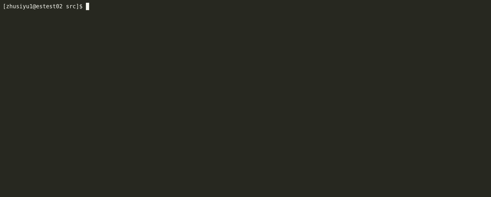
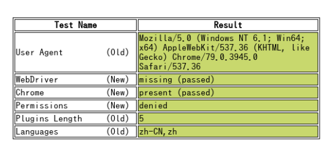

# crawlergo

 [](https://www.blackhat.com/eu-21/arsenal/schedule/index.html#crawlergo-a-powerful-browser-crawler-for-web-vulnerability-scanners-25113)

> 面向 Web 漏洞扫描场景的浏览器爬虫

[English Document](./README.md) | 中文文档

crawlergo 使用 `chrome headless` 渲染页面，通过 DOM/JS 事件触发、自动填表与请求拦截，尽可能发现网站暴露的入口请求。

## 功能特性

* 真实浏览器环境渲染
* 自动填充并提交表单
* 自动触发常见 DOM/JS 事件
* 智能去重（支持伪静态过滤）
* 解析页面、JS、注释、robots、路径 fuzz 获取更多入口
* 支持 Host 绑定与 Referer 修正
* 支持代理
* 支持结果推送给被动扫描器

## 运行截图



## 安装

使用前请先阅读 [免责声明](./Disclaimer.md)。

### 编译

```shell
make build
```

```shell
make build_all
```

### 运行依赖

1. 安装 Chromium/Chrome（建议新版本）。
2. 下载 release 二进制，Linux/macOS 记得加执行权限。
3. 或直接从源码编译。

## Quick Start

### 单目标

```shell
bin/crawlergo -c /tmp/chromium/chrome -t 10 http://testphp.vulnweb.com/
```

### 使用代理

```shell
bin/crawlergo -c /tmp/chromium/chrome -t 10 --request-proxy socks5://127.0.0.1:7891 http://testphp.vulnweb.com/
```

### 批量爬取（文件输入）

通过 `-i` 读取目标文件（每行一个 URL）：

```shell
bin/crawlergo -i urls.txt -c /tmp/chromium/chrome -t 10 -o txt --output-txt all_result.txt
```

`urls.txt` 示例：

```text
http://vulnweb.com/
http://testhtml5.vulnweb.com/
http://testasp.vulnweb.com/
http://testaspnet.vulnweb.com/
http://testphp.vulnweb.com/
```

说明：

* 支持空行。
* `#` 开头行会被忽略。
* `-o txt` 时输出为一行一个 URL（来自 `req_list`，按 URL 去重）。

### Python 调用示例

```python
#!/usr/bin/python3
# coding: utf-8

import simplejson
import subprocess

def main():
    target = "http://testphp.vulnweb.com/"
    cmd = ["bin/crawlergo", "-c", "/tmp/chromium/chrome", "-o", "json", target]
    rsp = subprocess.Popen(cmd, stdout=subprocess.PIPE, stderr=subprocess.PIPE)
    output, error = rsp.communicate()
    result = simplejson.loads(output.decode().split("--[Mission Complete]--")[1])
    req_list = result["req_list"]
    print(req_list[0])

if __name__ == '__main__':
    main()
```

## 输出结果说明

当 `-o json` 时，反序列化后包含：

* `all_req_list`: 本次任务发现的全部请求（含跨域/资源类请求）。
* `req_list`: 当前目标域下、经过过滤后的请求集合。
* `all_domain_list`: 发现到的全部域名。
* `sub_domain_list`: 发现到的子域名。

## 参数说明

### 必选参数

* `--chromium-path Path, -c Path`：Chrome 可执行文件路径。

### 基础参数

* `--input-file Path, -i Path`：从文件读取目标 URL，每行一个。
* `--custom-headers Headers`：自定义 HTTP 头（JSON 字符串）。
* `--post-data PostData, -d PostData`：入口使用 POST 并附带数据。
* `--max-crawled-count Number, -m Number`：最大爬取请求数。
* `--filter-mode Mode, -f Mode`：过滤模式，`simple|smart|strict`。
* `--output-mode value, -o value`：输出模式，`console|json|txt|none`。
* `--output-json filepath`：将 JSON 结果写入文件。
* `--output-txt filepath`：将 txt 结果写入文件。
* `--request-proxy proxyAddress`：全局请求代理。

### 扩展输入 URL

* `--fuzz-path`：使用内置字典进行根路径 fuzz（`scheme://host/FUZZ`）。
* `--fuzz-path-dict`：使用自定义字典进行根路径 fuzz（每行一个路径词）。
* `--robots-path`：从 `/robots.txt` 解析路径。

### 表单与过滤

* `--ignore-url-keywords, -iuk`：忽略包含关键词的 URL。
* `--form-values, -fv`：按字段类型设置表单填充值。
* `--form-keyword-values, -fkv`：按关键词模糊匹配设置填充值。

### 爬取过程

* `--max-tab-count Number, -t Number`：并发 tab 数。
* `--tab-run-timeout Timeout`：单 tab 超时。
* `--wait-dom-content-loaded-timeout Timeout`：等待 DOM ready 超时。
* `--event-trigger-interval Interval`：事件触发间隔。
* `--event-trigger-mode Value`：事件触发模式，`async|sync`。
* `--before-exit-delay`：tab 结束前额外等待。
* `--max-run-time`：任务总超时（秒）。

### 其他参数

* `--push-to-proxy`：将 `req_list` 推送到被动扫描器监听地址。
* `--push-pool-max`：推送并发上限。
* `--log-level`：日志级别，`debug|info|warn|error|fatal`。
* `--no-headless`：关闭无头模式。

## 使用建议

* 先跑小并发验证可用性，再逐步提高并发。
* 批量场景优先输出 `txt`，方便后续自动化处理。
* 自定义 fuzz 字典建议先从 500-2000 行起步。

## Trouble Shooting

### `Fetch.enable wasn't found`

说明 Chrome 版本过低，请升级浏览器。

### 缺少依赖库（Linux）

可参考英文 README 的依赖安装列表。

### 导航超时 / 浏览器路径找不到

先确认 `-c` 指向正确的可执行文件路径。

## Bypass headless detect

crawlergo 默认包含部分 headless 规避策略：

https://intoli.com/blog/not-possible-to-block-chrome-headless/chrome-headless-test.html


